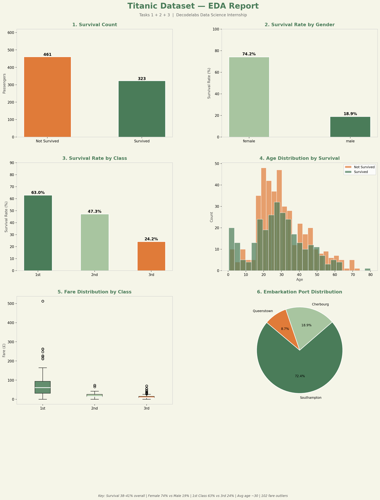

# 🚢 Titanic Dataset — Data Science Project
### Decodelabs Data Science Internship | Task Submission


---

## 📋 Overview

This project was completed as part of the **Decodelabs Data Science Internship**. It covers three core tasks of the data science pipeline — from raw data collection to exploratory analysis — using the classic **Titanic dataset**.

The Titanic dataset contains information about 891 passengers aboard the RMS Titanic, which sank on April 15, 1912. The goal is to explore the data and uncover patterns related to passenger survival.

---

## ✅ Tasks Completed

| # | Task | Description |
|---|------|-------------|
| 1 | **Data Collection & Dataset Understanding** | Loaded dataset, identified all columns, data types, size, and missing values |
| 2 | **Data Cleaning & Preprocessing** | Handled missing values, removed duplicates, dropped irrelevant columns, encoded categoricals |
| 3 | **Exploratory Data Analysis (EDA)** | Calculated statistics, identified trends, detected outliers, summarized key findings |

---

## 📁 Project Structure

```
decodelabs-titanic-project/
│
├── decodelabs_project_ali.py   # Main project script (all 3 tasks)
├── eda_visualizations.png      # EDA charts output
└── README.md                   # This file
```

---

## 🗂️ Dataset

- **Name:** Titanic Passenger Dataset
- **Source:** Seaborn built-in (`sns.load_dataset('titanic')`) — original Kaggle data
- **Shape:** 891 rows × 15 columns
- **Target column:** `survived` (0 = No, 1 = Yes)

### Key Columns

| Column | Type | Description |
|--------|------|-------------|
| `survived` | int | Survival outcome (target) |
| `pclass` | int | Passenger class (1 = 1st, 2 = 2nd, 3 = 3rd) |
| `sex` | str | Gender |
| `age` | float | Age in years |
| `sibsp` | int | # of siblings/spouses aboard |
| `parch` | int | # of parents/children aboard |
| `fare` | float | Ticket fare (£) |
| `embarked` | str | Port of embarkation (S / C / Q) |

---

## 🧹 Task 2: Cleaning Steps

1. **Removed duplicates** — 107 duplicate rows dropped
2. **Filled missing `age`** — replaced with median (28.0 yrs), robust to skew
3. **Filled missing `embarked`** — replaced with mode (`'S'`)
4. **Dropped `deck`** — over 77% values missing, not recoverable
5. **Dropped redundant columns** — `who`, `adult_male`, `embark_town`, `alive`, `alone`, `class`
6. **Encoded categoricals** — `sex` → (male=0, female=1), `embarked` → (S=0, C=1, Q=2)

**Result:** 784 rows × 9 clean columns, zero missing values

---

## 📊 Task 3: Key Findings

> **Overall survival rate was only ~38–41% — the majority did not survive.**

| Finding | Detail |
|---------|--------|
| 👩 Gender | Females survived at **74.2%** vs males at **18.9%** — "women and children first" was enforced |
| 🎫 Class | 1st class: **63%** survival &nbsp;|&nbsp; 2nd class: **47%** &nbsp;|&nbsp; 3rd class: **24%** |
| 🎂 Age | Average age ~30 yrs. Younger children had relatively higher survival rates |
| 💰 Fare | Range: £0 – £512. **102 outliers** detected via IQR method. Higher fare correlated with survival |
| 🚢 Port | Southampton accounted for ~72% of passengers (most common embarkation point) |

---

## 📈 Visualizations

The script generates a 6-panel EDA chart saved as `eda_visualizations.png`:

1. Survival Count (bar chart)
2. Survival Rate by Gender
3. Survival Rate by Passenger Class
4. Age Distribution by Survival (overlapping histogram)
5. Fare Distribution by Class (box plot)
6. Embarkation Port Distribution (pie chart)



---

## ▶️ How to Run

**1. Clone the repo**
```bash
git clone https://github.com/your-username/decodelabs-titanic-project.git
cd decodelabs-titanic-project
```

**2. Install dependencies**
```bash
pip install pandas numpy matplotlib seaborn
```

**3. Run the script**
```bash
python decodelabs_project_ali.py
```

The script will print all task outputs to the console and save `eda_visualizations.png` in the same directory.

---

## 🛠️ Tech Stack

- **Python 3.8+**
- **Pandas** — data manipulation and cleaning
- **NumPy** — numerical operations
- **Seaborn** — dataset loading and plot styling
- **Matplotlib** — custom visualizations

---

## 👤 Author

**Ali**
B.Tech CSE (Data Science & AI) — Aurora Higher Education and Research Academy (JNTU Hyderabad)
Tech Lead, DataWizards Community

---

## 🏢 Internship

**Organization:** [Decodelabs](https://www.decodelabs.tech)
**Program:** Data Science Internship — Task Project
**Tasks Submitted:** Task 1 · Task 2 · Task 3
