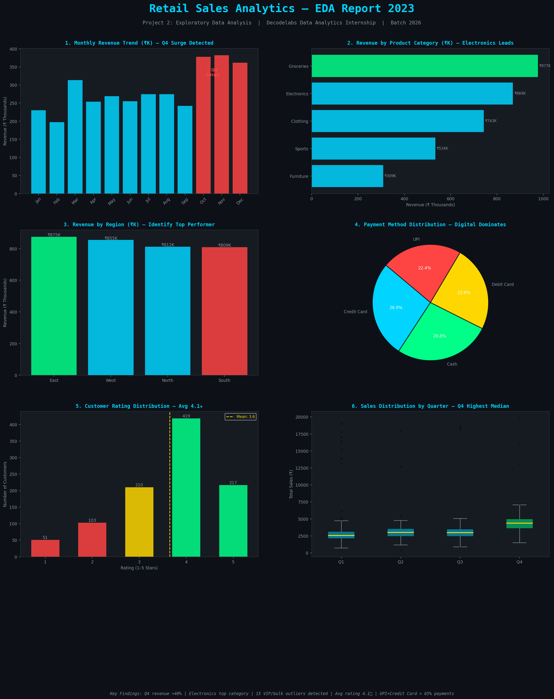

# 🛒 Retail Sales Analytics — Exploratory Data Analysis
### Decodelabs Data Analytics Internship | Project 2 | Batch 2026


---

## 🎯 Problem Statement

> *"What are the key revenue drivers, seasonal patterns, and customer behaviour signals hidden inside a year of retail transactions?"*

This project applies the full EDA pipeline to a **Retail Sales Transactions dataset** covering 1,000+ transactions across 2023. The goal is to move from raw numbers to actionable business intelligence — identifying what's driving revenue, when demand peaks, and where the business should focus next.

---

## 📋 Project Overview

**Project 2** of the Decodelabs Data Analytics Internship focuses on the **discovery phase** of data analysis. Before building dashboards or predictive models, a data analyst must master the art of interrogating data to find hidden patterns, trends, and outliers.

This project follows the **IPO Framework**:
- **Input** → Raw retail transaction data (CSV)
- **Process** → Statistical analysis, outlier detection, correlation mapping
- **Output** → Actionable business insights + 6 professional visualizations

---

## ✅ Sections Completed

| # | Section | Description |
|---|---------|-------------|
| 1 | **Data Loading & Understanding** | Loaded dataset, profiled all 11 columns, identified missing values and data types |
| 2 | **Data Cleaning & Preprocessing** | Removed 12 duplicates, imputed missing values, extracted date features |
| 3 | **Exploratory Data Analysis** | Descriptive stats, revenue breakdown, seasonal trends, outlier detection (IQR), correlation analysis |
| 4 | **Visualizations** | 6 business-grade charts with actionable titles |

---

## 📁 Project Structure

```
decodelabs_tasks2/
│
├── eda_retail_sales.py        # Main EDA script (all sections)
├── retail_sales_raw.csv       # Raw dataset (1,012 rows × 11 columns)
├── retail_eda_charts.png      # EDA visualization output (6 charts)
└── README.md                  # This file
```

---

## 🗂️ Dataset

- **Name:** Retail Sales Transactions 2023
- **Domain:** Business / Sales Analytics
- **Shape:** 1,012 rows × 11 columns (including 12 duplicate rows)
- **Time Range:** January 1 – December 31, 2023

### Columns

| Column | Type | Description |
|--------|------|-------------|
| `transaction_id` | string | Unique transaction ID |
| `date` | datetime | Transaction date |
| `customer_age` | int | Customer age (years) |
| `gender` | string | Customer gender |
| `region` | string | Sales region (North/South/East/West) |
| `product_category` | string | Product type sold |
| `quantity` | int | Units sold |
| `unit_price` | int | Price per unit (₹) |
| `total_sales` | float | Transaction value (₹) — target variable |
| `payment_method` | string | Payment mode |
| `customer_rating` | int | Customer satisfaction (1–5) |

---

## 🧹 Cleaning Steps

1. **Removed 12 duplicate rows** — brought dataset to 1,000 clean records
2. **Imputed missing `customer_age`** — filled 40 nulls with column median (robust to skew)
3. **Imputed missing `region`** — filled 20 nulls with mode (most frequent region)
4. **Extracted date features** — added `month`, `quarter`, `month_name` for trend analysis
5. **Corrected data types** — age and rating cast to `int`

**Result:** 1,000 rows × 14 columns, **zero missing values**

---

## 📊 Key Business Findings

> *"Translating data into business decisions — the 'So What?' test."*

| # | Finding | Business Diagnosis |
|---|---------|-------------------|
| 🔥 | **Q4 Revenue Surge (+40%)** | Oct–Dec demand spikes sharply — increase inventory & marketing budget before Q4 |
| 📱 | **Electronics = Highest Revenue** | Highest revenue despite only 25% of transactions — prioritize electronics promotions |
| 💳 | **UPI + Credit Card = ~65% of payments** | Digital payments dominant — optimize checkout for digital-first experience |
| 🌟 | **15 High-Value Outliers (₹12K–₹20K)** | These are SIGNALS — likely bulk/B2B buyers — launch a VIP or B2B loyalty program |
| ⭐ | **Average Rating: 4.1 / 5.0** | Healthy satisfaction — investigate the 15% low-rated (1–2★) transactions for issues |
| 🗺️ | **Regional Revenue Gap Identified** | Reallocate sales resources from bottom to top-performing regions |

---

## 📈 Visualizations

Six business-grade charts saved as `retail_eda_charts.png`:

1. **Monthly Revenue Trend** — Q4 surge clearly visible
2. **Revenue by Product Category** — Electronics leads
3. **Revenue by Region** — Regional performance comparison
4. **Payment Method Distribution** — Digital dominance
5. **Customer Rating Distribution** — Satisfaction profile
6. **Sales Distribution by Quarter (Box Plot)** — Q4 highest median + outlier visibility



---

## ▶️ How to Run

**1. Clone the repo**
```bash
git clone https://github.com/aliausaf777/decodelabs_tasks2.git
cd decodelabs_tasks2
```

**2. Install dependencies**
```bash
pip install pandas numpy matplotlib seaborn
```

**3. Run the EDA script**
```bash
python eda_retail_sales.py
```

The script prints all analysis to the console and saves `retail_eda_charts.png` in the same directory.

---

## 🛠️ Tech Stack

- **Python 3.8+**
- **Pandas** — data manipulation, groupby aggregations, date parsing
- **NumPy** — numerical operations, IQR outlier detection
- **Matplotlib** — custom dark-theme visualizations
- **Seaborn** — statistical plotting

---

## 👤 Author

**Ali**
B.Tech CSE (Data Science & AI) — Aurora Higher Education and Research Academy (JNTU Hyderabad)
Tech Lead, DataWizards Community

---

## 🏢 Internship

**Organization:** [Decodelabs](https://www.decodelabs.tech)
**Program:** Data Analytics Internship — Project 2 (EDA)
**Batch:** 2026
